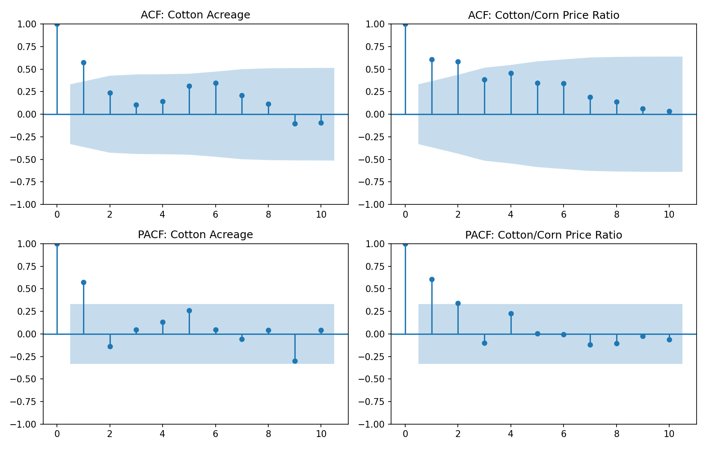
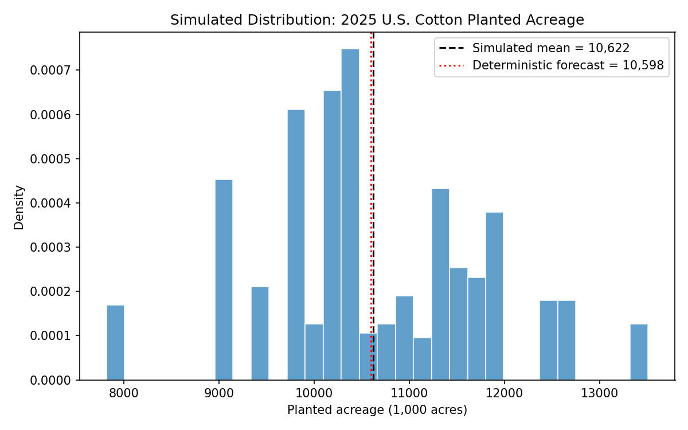

# U.S. Cotton Acreage Forecasting: Econometrics + Monte Carlo Simulation in Python

A Python reimplementation of an applied agricultural economics forecasting
project I worked on as a Graduate Research Assistant at the University of
Georgia. The original analysis — an econometric model of U.S. cotton
planted acreage combined with a stochastic (Monte Carlo) simulation — was
published as:

> Parajuli, Shikshit, and Yangxuan Liu. "[Projections for 2025 Cotton
> Acreage](https://southernagtoday.org/2025/04/30/projections-for-2025-cotton-acreage-2/)."
> *Southern Ag Today* 5(18.3), April 30, 2025.

**Why this repo exists:** the original analysis combined STATA (for
time-series diagnostics — ACF/PACF, Newey-West, Augmented Dickey-Fuller)
with Excel/SIMETAR (for the multiple regression and Monte Carlo
simulation). Neither is inspectable by someone without a STATA or SIMETAR
license, so this repo rebuilds the full analysis from scratch in Python —
the same research question, data, and model, implemented with open,
reproducible tooling (`pandas`, `statsmodels`, `numpy`, `matplotlib`). The
original `.do` file is kept in `stata_workflow/` for reference and runs
directly against `data/cotton_national_1990_2024.csv`.

## Research question

How much cotton acreage will U.S. farmers plant in a given year, and how
much uncertainty surrounds that forecast?

Farmers' planting decisions respond to crop rotation, expected profitability,
and how cotton's price compares to competing crops. In much of the Cotton
Belt, corn is the primary competing crop, so the **cotton-to-corn price
ratio** is a key driver of acreage swings alongside inertia from the
previous year's planted acreage.

## Data

- **Source:** USDA National Agricultural Statistics Service (NASS) and USDA
  WASDE reports
- **Coverage:** U.S. national upland + Pima cotton, 1990–2024 (35 annual
  observations)
- **File:** `data/cotton_national_1990_2024.csv`

| column | description |
|---|---|
| `year` | Calendar year |
| `area_1000ac` | Total planted cotton acreage (1,000 acres) |
| `yield_lb_per_ac` | Cotton yield (lb/acre) |
| `pratio_cotton_corn` | Cotton price (cents/lb) ÷ corn price ($/bu) |
| `price_cotton_cents_lb` | Cotton price (cents/lb) |
| `price_corn_dollar_bu` | Corn price ($/bu) |

## Methodology

**1. Time-series diagnostics** (`src/regression_diagnostics.py`)
ACF/PACF plots on acreage and the price ratio to check persistence and
inform lag selection, mirroring the diagnostic steps in the original STATA
workflow (`stata_workflow/cotton_national_2025_forecasting.do`).

**2. Regression model**

```
AREA_t = β0 + β1·AREA_(t-1) + β2·PRATIO_(t-1) + β3·PRICE_COTTON_t + ε_t
```

Estimated by OLS, with Newey-West (HAC) standard errors as a robustness
check against residual autocorrelation. An Augmented Dickey-Fuller test on
the regression residuals confirms they are stationary (rejects the unit-root
null at the 5% level), supporting the validity of the levels regression.

**3. Monte Carlo simulation** (`src/monte_carlo_simulation.py`)
Rather than reporting a single point forecast, the model's historical
residuals are bootstrap-resampled and added to the deterministic 2025
forecast to build a full probability distribution of plausible outcomes —
reproducing the stochastic forecasting approach used in the original
SIMETAR simulation, without relying on a parametric (e.g., normal)
assumption the small sample may not support.

## Results

| | Original (SIMETAR) | This Python replication |
|---|---|---|
| R² | 0.688 | 0.689 |
| Deterministic 2025 forecast | 10,524k acres | 10,598k acres |
| Simulated mean | 10,432k acres | 10,622k acres |
| Simulated std. dev. | 1,136 | 1,154 |

The close match confirms the Python implementation faithfully reproduces
the original model. Minor differences reflect small rounding differences
in the underlying price/ratio inputs and the choice of bootstrap vs.
parametric residual resampling.




## Repo structure

```
.
├── data/                        # Cleaned NASS/WASDE panel data
├── src/
│   ├── data_prep.py              # Load data, construct lagged variables
│   ├── regression_diagnostics.py # ACF/PACF, OLS, Newey-West, ADF test
│   └── monte_carlo_simulation.py # Bootstrap Monte Carlo forecast
├── outputs/                      # Generated plots
├── stata_workflow/                # Original .do file (STATA), reference only
└── requirements.txt
```

## Running it

```bash
pip install -r requirements.txt
cd src
PYTHONPATH=. python3 regression_diagnostics.py
PYTHONPATH=. python3 monte_carlo_simulation.py
```

## License

MIT — see [LICENSE](LICENSE).

## Note on the STATA file

`stata_workflow/cotton_national_2025_forecasting.do` runs the same
diagnostics and regression (ACF/PACF, lagged variables, OLS, Newey-West,
Augmented Dickey-Fuller) directly against
`data/cotton_national_1990_2024.csv`. It requires a STATA license to run
and is included as a reference artifact — the Python code in `src/` is the
actively maintained, executable version of this analysis.
